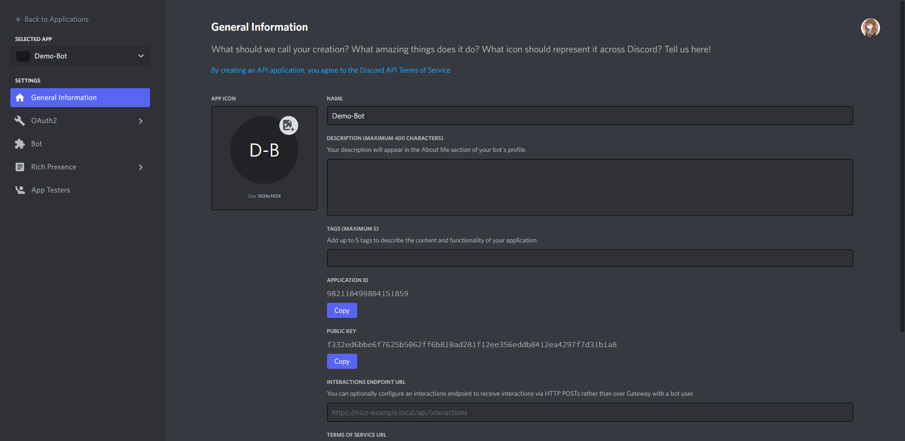
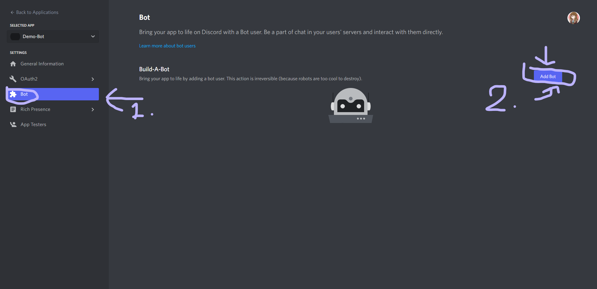
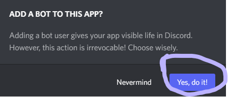
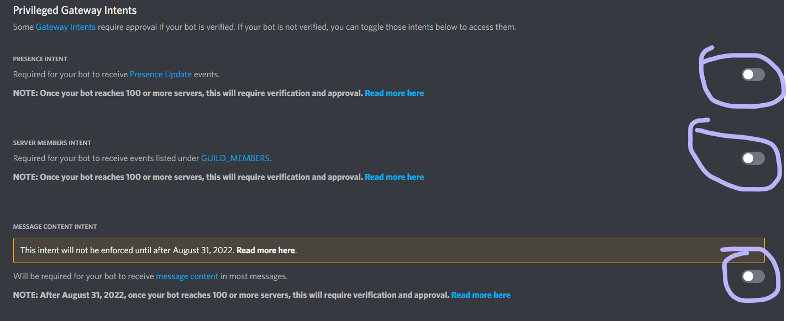
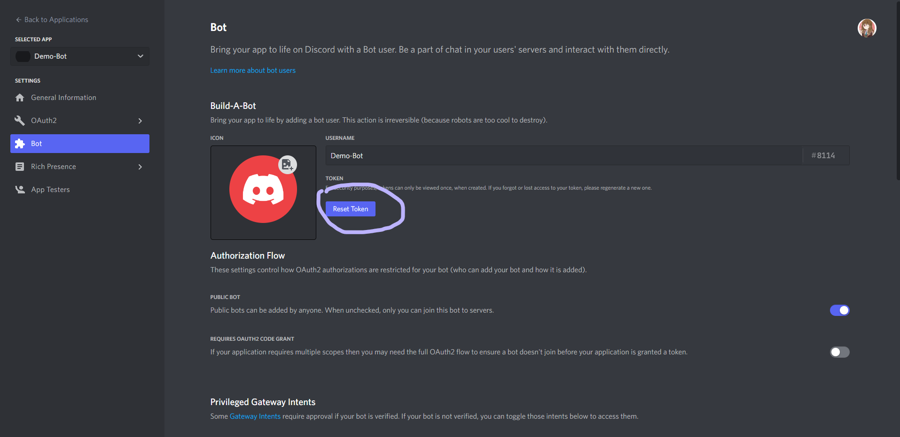
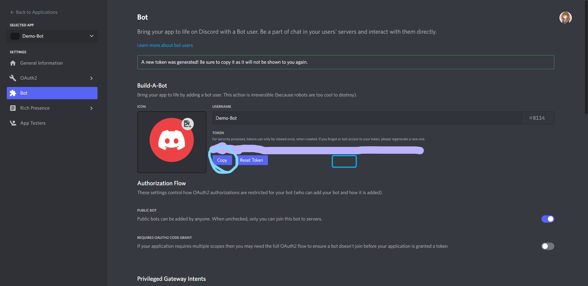

# Getting Started

This will have everything needed in order to get started with development for Rin.

## Requirements

To get started, you'll need these things installed: 

- [Git](https://git-scm.com/)
- [Python 3.10](https://www.python.org/)
- [Pipenv](https://pipenv.pypa.io/en/latest/)
- [WSL](https://docs.microsoft.com/en-us/windows/wsl/) (If working on Windows)
- Discord Account + Discord App

## Installing Dependencies

Getting the environment set up for the bot is a kinda complex process. Rin now uses [Uvloop](https://github.com/MagicStack/uvloop), which is a drop-in replacement for [Asyncio](https://docs.python.org/3/library/asyncio.html) and is just as fast as Node.js. If you want to get set up, here are the instructions to do so:

## Windows 

1. Install [WSL2](https://docs.microsoft.com/en-us/windows/wsl/). Pick your distro of choice. In this example, we will use Ubuntu 22.04
2. Install the suggested build dependencies for pyenv. 

    ```sh
    sudo apt-get update; sudo apt-get install make build-essential libssl-dev zlib1g-dev \
    libbz2-dev libreadline-dev libsqlite3-dev wget curl llvm \
    libncursesw5-dev xz-utils tk-dev libxml2-dev libxmlsec1-dev libffi-dev liblzma-dev python3.10-dev git
    ```

3. Install Pyenv. Also make sure to follow the instructions [here](https://github.com/pyenv/pyenv#set-up-your-shell-environment-for-pyenv)

    ```sh
    curl https://pyenv.run | bash
    pyenv update
    pyenv install 3.10.6
    pyenv global 3.10.6
    pyenv rehash
    ```

4. Restart your shell (make sure you have added it to your path and configured it either in your `.zshrc`, or `.bashrc` files)
    
    ```sh
    exec "$SHELL"
    ```

5. Fork and clone the repo

    ```sh
    git clone https://github.com/[username]/Rin.git && cd Rin
    ```


6. Run Make to create the venv and install dependencies

    ```sh
    make dev-setup
    ```

## Linux
    
### Ubuntu

1. Install the suggested build dependencies for pyenv. 

    ```sh
    sudo apt-get update; sudo apt-get install make build-essential libssl-dev zlib1g-dev \
    libbz2-dev libreadline-dev libsqlite3-dev wget curl llvm \
    libncursesw5-dev xz-utils tk-dev libxml2-dev libxmlsec1-dev libffi-dev liblzma-dev python3.10-dev git
    ```

2. Install Pyenv. Also make sure to follow the instructions [here](https://github.com/pyenv/pyenv#set-up-your-shell-environment-for-pyenv)

    ```sh
    curl https://pyenv.run | bash
    pyenv update
    pyenv install 3.10.6
    pyenv global 3.10.6
    pyenv rehash
    ```

3. Restart your shell (make sure you have added it to your path and configured it either in your `.zshrc`, or `.bashrc` files)
    
    ```sh
    exec "$SHELL"
    ```

4. Fork and clone the repo

    ```sh
    git clone https://github.com/[username]/Rin.git && cd Rin
    ```

5. Run Make to create the venv and install dependencies

    ```sh
    make dev-setup
    ```

### OpenSUSE

1. Install the suggested build dependencies for pyenv.

    ```sh
    sudo zypper install gcc automake bzip2 libbz2-devel xz xz-devel openssl-devel ncurses-devel \
    readline-devel zlib-devel tk-devel libffi-devel sqlite3-devel python310-devel
    ```

2. Install Pyenv. Also make sure to follow the instructions [here](https://github.com/pyenv/pyenv#set-up-your-shell-environment-for-pyenv)

    ```sh
    curl https://pyenv.run | bash
    pyenv update
    pyenv install 3.10.6
    pyenv global 3.10.6
    pyenv rehash
    ```

3. Restart your shell (make sure you have added it to your path and configured it either in your `.zshrc`, or `.bashrc` files)
    
    ```sh
    exec "$SHELL"
    ```

4. Fork and clone the repo

    ```sh
    git clone https://github.com/[username]/Rin.git && cd Rin
    ```

5. Run Make to create the venv and install dependencies

    ```sh
    make dev-setup
    ```

### Fedora/CentOS

1. Install the suggested build dependencies for pyenv

    Fedora 22 and above:

    ```sh
    sudo dnf install make gcc zlib-devel bzip2 bzip2-devel readline-devel sqlite sqlite-devel openssl-devel tk-devel libffi-devel xz-devel python-devel git curl
    ```

    CentOS or Fedora 22 and below:

    ```sh
    sudo yum install gcc zlib-devel bzip2 bzip2-devel readline-devel sqlite sqlite-devel openssl-devel tk-devel libffi-devel xz-devel python-devel git curl
    ```

2. Install Pyenv. Also make sure to follow the instructions [here](https://github.com/pyenv/pyenv#set-up-your-shell-environment-for-pyenv)

    ```sh
    curl https://pyenv.run | bash
    pyenv update
    pyenv install 3.10.6
    pyenv global 3.10.6
    pyenv rehash
    ```

3. Restart your shell (make sure you have added it to your path and configured it either in your `.zshrc`, or `.bashrc` files)
    
    ```sh
    exec "$SHELL"
    ```

4. Fork and clone the repo

    ```sh
    git clone https://github.com/[username]/Rin.git && cd Rin
    ```

5. Run Make to create the venv and install dependencies

    ```sh
    make dev-setup
    ```
### Arch/Manjaro

1. Install the suggested build dependencies for pyenv

    ```sh
    sudo pacman -S --needed base-devel openssl zlib xz tk python libffi
    ```

2. Install Pyenv. Also make sure to follow the instructions [here](https://github.com/pyenv/pyenv#set-up-your-shell-environment-for-pyenv)

    ```sh
    curl https://pyenv.run | bash
    pyenv update
    pyenv install 3.10.6
    pyenv global 3.10.6
    pyenv rehash
    ```

3. Restart your shell (make sure you have added it to your path and configured it either in your `.zshrc`, or `.bashrc` files)
    
    ```sh
    exec "$SHELL"
    ```

4. Fork and clone the repo

    ```sh
    git clone https://github.com/[username]/Rin.git && cd Rin
    ```

5. Run Make to create the venv and install dependencies

    ```sh
    make dev-setup
    ```

## MacOS

1. Install Xcode Command Line Tools (`xcode-select --install`) and [Homebrew](https://brew.sh/)

2. Install the suggested build dependencies for pyenv

    ```sh
    brew install openssl readline sqlite3 xz zlib tcl-tk git curl make
    ```
3. Install Pyenv via Homebrew

    ```sh
    brew update
    brew install pyenv
    ```

4. Install Python

    ```sh
    pyenv update
    pyenv install 3.10.6
    pyenv global 3.10.6
    pyenv rehash
    ```

5. Follow the rest of the steps, starting on [Set Up Your shell Environment For Pyenv](https://github.com/pyenv/pyenv#set-up-your-shell-environment-for-pyenv)

5. Fork and clone the repo

    ```sh
    git clone https://github.com/[username]/Rin.git && cd Rin
    ```

6. Run Make to create the venv and install dependencies

    ```sh
    make dev-setup
    ```
## Getting Started

### Getting the Discord Bot

First things first, you'll more than likely need a dev bot to run Rin. Luckily you'll find the steps below to help you on that



1. Create the app that will be needed for the bot. Once done, you should see the page as shown above



2. Now head done to the bot section, and click on the button that says "Add Bot". 



3. You'll see a pop-up that asks you if you want to create the bot. 



4. Make sure to have all 3 of the buttons enabled. Rin will need all 3 of them to work.



5. You'll see a page just like the one above. We'll need access the the token for the bot, and the only way to do it is to reset the token.


6. Allow for the token to be reset. Note that if your account is hooked up with 2FA, it will ask you to enter your 2FA code. Go to your authenticator app and enter the code from the app.



7. Now click on the copy button and copy the token

8. Head back into the root directory of the repo, and run this command: 

   ```sh
   make init BOT_TOKEN="[token]"
   ```

   This will create a `.env` file and add the token into it.

### Developing Rin 

Once you have the discord bot up, there's a few things that needs to be done before development can begin. 

1. Follow the steps in [Installing Dependencies](#installing-dependencies) to get all of the dependencies installed.
2. Now create a shell that pipenv needs. Run the following command:

    ```sh
    pipenv shell
    ```

3. To run Rin, run the following command:

   ```sh
   make
   ```

   You could also run this command, which does the same thing:

   ```sh
   make run
   ```

   To exit out of Rin, hit Ctrl + C to kill the process. 

### Things to keep in mind

Make sure to always keep this in mind: Always add exception handling for Rin. And make sure it is done correctly. A poor example would be this:

   ```py
   try:
      async with aiohttp.ClientSession(json_serialize=ujson.dumps) as session:
         async with session.get(url) as resp:
            data = await resp.content.read()
            dataMain = parser.parse(data, recursive=True)
            print(dataMain["data"]["children"][0]["data"]["title"]) # Doesn't exist within JSON data
   except Exception as e:
      await ctx.respond(e)
   ```
   But rather actually specify the exception that you want to handle.

   ```py

   try:
      async with aiohttp.ClientSession(json_serialize=ujson.dumps) as session:
         async with session.get(url) as resp:
            data = await resp.content.read()
            dataMain = parser.parse(data, recursive=True)
            print(dataMain["data"]["children"][0]["data"]["title"]) # Doesn't exist within JSON data
   except ValueError:
      await ctx.respond("That item doesn't exist! Please try again")
   ```

## API Keys

Some of the API's that Rin uses requires an API key. Here's the list of all of the services that require one:

- Twitter (requires bearer token, make sure that the bearer token supports Twitter API V2)
- Reddit 
- Hypixel
- *DeviantArt (Use the DA-Token-Refresher script in production for refreshing tokens)
- Tenor (Use API V2)
- First FRC
- Discord.bots.gg
- Top.gg
- GitHub
- YouTube
- Blue Alliance
- Twitch

*Note: DeviantArt is officially unsupported due to the process of handling the access tokens and refreshing them.

## Docker Tagging Styles

Rin does have in fact a style of tagging docker images. Here it is:

- If deploying to master or production (NOTE: DO NOT DEPLOY TO PRODUCTION UNLESS IT IS FULLY TESTED AND APPROVED):
    `<image>:<github_release_tag>`
    
- If deploying to dev:
    `<image>:<next_minor_version>-dev-<short_commit_sha>`