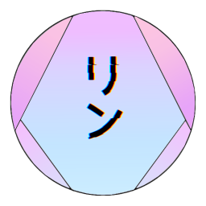

# Rin

 

 
           

A Discord bot focused on obtaining data from third-party services with lighting performance in mind

# Info

Rin is a Discord bot written with Pycord and Python, and is focused on fetching data from third-party services with lighting performance in mind. For example, you could look up some memes with the Reddit service, 
or find your favorite anime with the MyAnimeList service. Rin supports a lot of services, such as Twitter, MangaDex, Reddit, YouTube, Hypixel, and many more. Rin is also designed to be fast, and uses [Uvloop](https://github.com/MagicStack/uvloop) under the 
hood, which is 2 times faster than Node.js and reaches the same speeds as many Go programs. On top on that, Rin is powered by the fatest JSON parser in the world, SIMDJSON. For more info, please check out the [Docs](https://docs.rinbot.live/).

**For the future of Rin, please see this [gist](https://gist.github.com/No767/de27c61dc471ac331a45ea7c2bda62c0).**
## Modularity

Rin is designed to be modular, where you can remove cogs, or add new ones. In fact, you can build your entire bot on top of Rin, and [Kumiko](https://github.com/No767/Kumiko) basically does that. However, if you want to build your bot on top of Rin, you have to cite the bot as a fork of Rin (you are essentially using a fork of Rin if you decide to do so), link back the GitHub repo in somewhere that people will notice, and give credit to the original developer (which is me, No767).

## Self Hosting

In fact, you can self host your own version of Rin. For more information, please check out the [Getting Started Guide](./Community/getting-started-guide.md) for more info.
## Features

Rin comes with integration from 15+ services. Some of these services that are fully supported and integrated include:

- AniList
- MyAnimeList
- Twitter
- Modrinth
- YouTube
- Waifu.IM
- MangaDex
- Twitch
- GitHub

And many more!

# Prefix

Rin's prefix is `/`.

# Inviting the Bot

Via Top.gg, or any of the links in the [Bot Discovery Network](https://github.com/No767/Rin#bot-discovery-network-links) section. You can invite Rin by clicking [here](https://top.gg/bot/865883525932253184/invite). Note that previously (before v2.0.0), the prefix was `.`. Versions beyond v2.0.0 will only support the slash (`/`) prefix.

# Getting Started

if you would like to get started, here are some links to help you with that:

For end-users:
- [Getting Started Guide](./Community/getting-started-guide.md)
- [Documentation](https://docs.rinbot.live)

For Developers and Contributors:
- [Getting Started (For Developers)](https://github.com/No767/Rin/blob/dev/Community/getting-started-rin.md)
- [Contributing](https://github.com/No767/Rin/blob/dev/Community/contributing.md)
- [Documentation](https://docs.rinbot.live)

# Build Status

|                        | GitHub Container Registry (GHCR) | Docker Hub |
|       :---:            |           :---:                  |    :---:   |
|  **Alpine Linux (3.16)**   |                       |            |
| **Debian (11 / Bullseye)** |                                 |            |

# Links 

- [Documentation](https://docs.rinbot.live)
- [Website](https://rinbot.live)

## Bot Discovery Network Links

- [Top.gg](https://top.gg/bot/865883525932253184)
- [Discords.com](https://discords.com/bots/bot/865883525932253184)
- [Discord.bots.gg](https://discord.bots.gg/bots/865883525932253184) (Unverified)
- [Discord Labs](https://bots.discordlabs.org/bot/865883525932253184) (Unverified)

# Licensing

All of Rin's code is licensed under Apache-2.0
